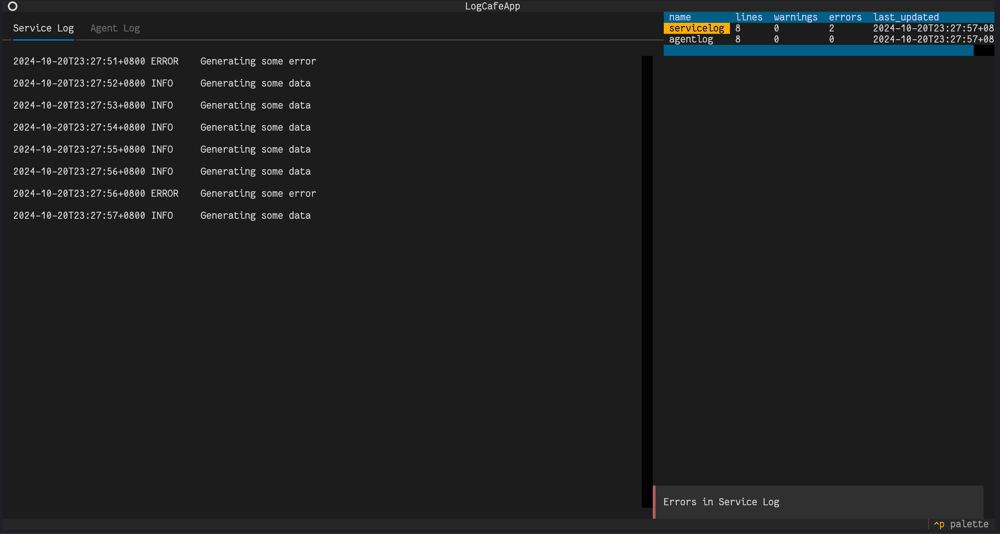

# logcafe

A simple TUI application for viewing multiple log files in a centralized place.

This started as just a fun half day project for (re)exploring Textual.
I like that it generates alert toasts for logs that are monitored but not necessarily the one in focus.
Particularly useful when having to monitor multiple logs for microservices but no centralized logging system has been set up yet.

Main technologies used:
- [Textual](https://textual.textualize.io/) for the TUI
- [Watchfiles](https://watchfiles.helpmanual.io/) for detecting changes to the monitored (log) files
- Python stdlib [mmap](https://docs.python.org/3.12/library/mmap.html) for reading files (logs could be very large)

Learnings:
- While handling single logfiles and offsets are somewhat simple, handling rotating log files is VERY HARD. The algorithm written in watch.py should handle many general cases, but things could still go wrong if rotation occurs while opening the files. AVOID THIS IF POSSIBLE!
- Prior to doing this, I thought that using inode numbers to track file rotations would be simple enough, but turns out that it happens often that the inode of the file that gets deleted during rotation is assigned to the next newly created log file!

Future:
- Explore the performance when dealing with say, 10 to 20 log files, written at say X logs per second
- It may be interesting to come back to re-implementing this in Rust when playing with [ratatui](https://ratatui.rs/)
